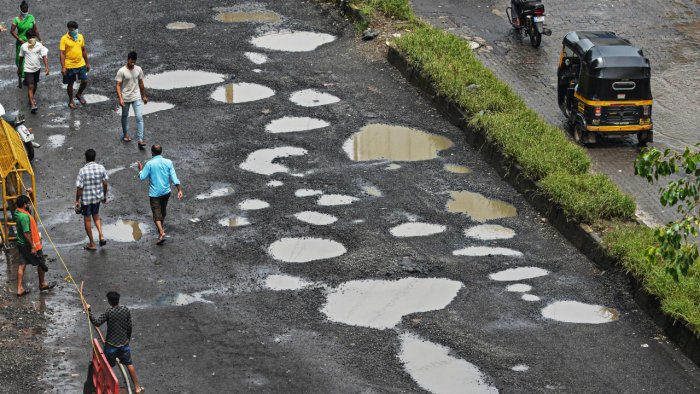
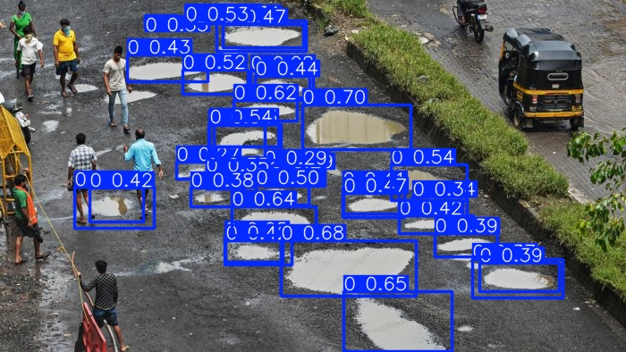

# Pothole Detection using YOLOv8

This project demonstrates a custom-trained **YOLOv8** object detection model for identifying potholes in road images.

---

## 📁 Files

- `Pothole_Detector.ipynb` – Colab notebook with training & inference
- `best.pt` – Trained YOLOv8 model weights
- `test_input_1.jpg`, `test_output_1.jpg` – Sample image and model output

---

## 📊 Model Performance

- **Box Loss:** ~1.45  
- **Class Loss:** ~1.11  
- **DFL Loss:** ~1.32  
- **mAP@50:** 0.692  
- **mAP@50–95:** 0.357  
- **Model:** YOLOv8s  
- **Epochs:** 25  
- **Image Size:** 416×416

---

## 🔍 Sample Output

**Input Image**  


**YOLOv8 Prediction**  


---

## 🛠️ How to Use

1. Install Ultralytics:
   ```bash
   pip install ultralytics
2. Run inference:
   ```bash
   from ultralytics import YOLO
   model = YOLO("best.pt")
   model.predict("your_test_image.jpg", save=True)
